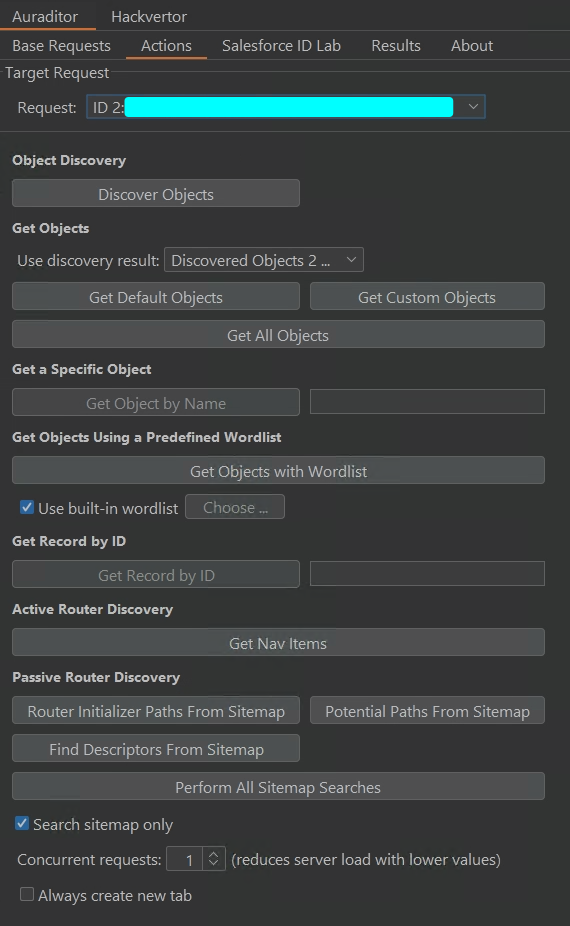
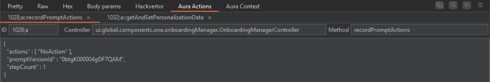
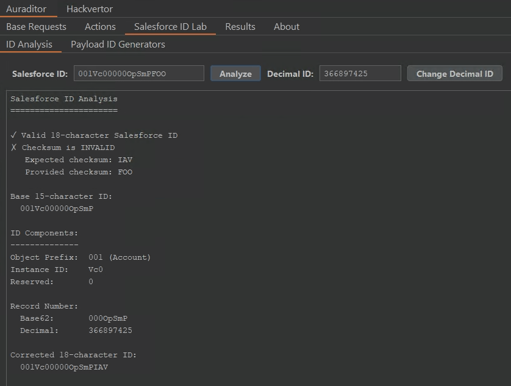

<div align="center">
  
</div>

# Auraditor

A Burp Suite extension for security testing Salesforce Lightning and Aura framework applications.

Developed by **Soroush Dalili ([@irsdl](https://github.com/irsdl))**.

## ⚠️ **DISCLAIMER**

**This tool is for authorized security testing only.**

- ❌ **NO SUPPORT**: The maintainer provides no support or warranty
- ❌ **NO LIABILITY**: The maintainer is not responsible for any damage, harm, or legal consequences
- ❌ **NO GUARANTEE**: The tool may not work properly or may cause issues
- ✅ **YOUR RESPONSIBILITY**: Users assume ALL responsibility for proper, legal, and authorized use

**Use at your own risk. Ensure you have proper authorization before testing any systems.**

## Features

### Request Editor
- View and edit Aura actions in HTTP requests
- Add and remove actions using tabs
- Edit controller names and method names
- Modify JSON parameters for each action
- Choose how to handle invalid JSON
- Copy, cut, and paste in text fields
- Toggle line wrapping for better readability

### Base Requests Management
- Save multiple base requests from HTTP history
- Tag requests with custom names
- Use saved requests for security testing operations

### Discovery Operations
- Find Aura controllers and methods from JavaScript files
- Discover Lightning Web Component (LWC) endpoints
- Extract API routes from application files
- Search for objects by name in the application

### Route Testing
- Test discovered routes automatically
- Categorize routes by response type
- Export results to files

### Salesforce ID Tools
- Analyze Salesforce ID structure and format
- Convert between 15-character and 18-character IDs
- Generate sequential Salesforce IDs
- Create custom ID payload generators for Burp Intruder
- Change decimal values in Salesforce IDs

## Requirements
- Java 21 or higher
- Burp Suite Professional 2025.x or later

## Building

### Using Maven wrapper (Windows):
```powershell
.\mvnw.cmd clean package
```

### Using Maven wrapper (Unix/Linux/macOS):
```bash
./mvnw clean package
```

### Using Maven directly:
```bash
mvn clean package
```

### Using VS Code:
- Press `Ctrl+Shift+P` and run "Tasks: Run Task"
- Select "Maven: Package" for a complete build

## Installing
In Burp Suite:
- Go to Extensions → Installed
- Click "Add"
- Locate the compiled jar file: `target/auraditor-*.jar`
- Click "Next" to install

## Technical Details

### Built With
- Burp Suite Montoya API
- Java 21
- Jackson JSON library
- Swing UI

## Development Methodology

This extension is developed using a multi‑agent workflow and the Vibe coding technique:
- Multiple AI agents (e.g., Claude, ChatGPT) collaborate under a strict planning and approval process defined in `agent.md`.
- Each agent prepares an implementation plan in `ai-context/tasks/{agent}-latest.md`, which is reviewed and approved before any changes.
- Commits are authored by the maintainer and co‑signed by contributing AI agents using GitHub‑recognized `Co-Authored-By` trailers.

See `agent.md` for the full AI development guidelines and workflows.

### What Changed From Original
- Updated to modern Burp Suite API
- Added tabs for managing actions
- Fixed dark mode text visibility
- Added context menus for text editing
- Fixed request updates not being sent
- Added user dialogs for error handling
- Added discovery features for Lightning components

## Versioning

This project uses [Semantic Versioning](https://semver.org/):
- **MAJOR** (x.0.0): Breaking changes
- **MINOR** (2.x.0): New features
- **PATCH** (2.1.x): Bug fixes

## Project Status

- ✅ Active development with new features
- ✅ Uses Burp Suite Montoya API (2025.8)
- ✅ Independent project, not affiliated with Salesforce
- ⚠️ No official support, use at your own risk

## Screenshots

### Main Interface


The main tab shows options for discovering routes, testing endpoints, and managing base requests.

### Request Editor


The request editor adds tabs to view and edit Aura actions, context, and messages.

### Salesforce ID Tools


Tools for analyzing Salesforce IDs and generating custom payloads for testing.

## Additional Resources

### Security Testing Guides
- [Salesforce Penetration Testing Fundamentals](https://projectblack.io/blog/salesforce-penetration-testing-fundamentals/)
- [Exposing Broken Access Controls in Salesforce-based Applications](https://cilynx.com/penetration-testing/exposing-broken-access-controls-in-salesforce-based-applications/2047/)
- [Misconfigured Salesforce Experiences](https://www.varonis.com/blog/misconfigured-salesforce-experiences)

### Salesforce ID Documentation
- [Salesforce IDs Explained](https://codebycody.com/salesforce-ids-explained/)
- [Converting IDs from 15 to 18 Characters](https://codebycody.com/salesforces-algorithm-for-converting-ids-from-15-to-18-characters/)
- [Salesforce Object Key Prefixes](https://help.salesforce.com/s/articleView?id=000385203&type=1)
- [Obscure Salesforce Object Key Prefixes](https://www.fishofprey.com/2011/09/obscure-salesforce-object-key-prefixes.html)

## Related Projects

These projects provide additional tools for Salesforce security testing:
- [aura-dump](https://github.com/prjblk/aura-dump) - Tool for exploring Aura framework data
- [AuraIntruder](https://github.com/pingidentity/AuraIntruder/) - Automated Aura framework testing extension

## Credits

This project builds upon [salesforce/lightning-burp](https://github.com/salesforce/lightning-burp) (now archived).

Auraditor is a complete rewrite with modern API, new features, and independent development.

## Contributors

- **Soroush Dalili** ([@irsdl](https://github.com/irsdl)) - Project maintainer
- **AI Collaboration** - Technical implementation and code optimization
